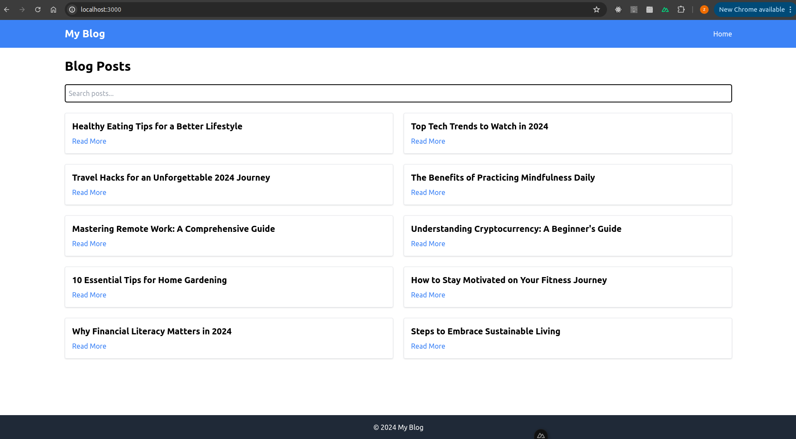

# Blog Project

A Vue 3-based blog application built with the Nuxt.js framework. This project allows users to browse blog posts, search through them, and dynamically display content using Tailwind CSS for styling.

---


##  Features

-  **Search Functionality**: Easily search for blog posts by title.
-  **Dynamic Blog Post Rendering**: Posts are rendered dynamically from JSON data.
-  **Responsive Design**: Built with Tailwind CSS for a 

---

## Technologies Used

- **Nuxt.js**: The framework powering the application.
- **Vue 3**: JavaScript framework for building user interfaces.
- **Tailwind CSS**: Utility-first CSS framework for rapid UI development.
- **JSON**: Blog post data is stored and dynamically loaded from JSON.

---

## Installation and Setup

1. Clone the repository:
   ```bash
   git clone https://github.com/zohaibshahzadkhan/blog-app-Nuxt3
   cd blog-project
   npm install
   npm run dev
  